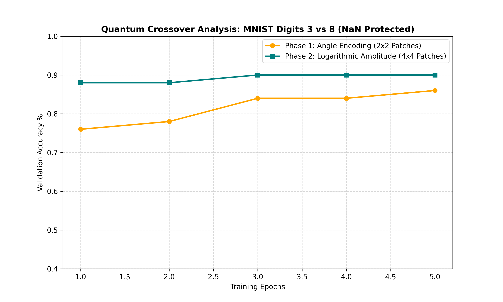

# Logarithmic Quantum Computer Vision: Amplitude Encoded QCNN

A hardware-accelerated **Hybrid Quantum-Classical Convolutional Neural Network (QCNN)** implementing high-density **Logarithmic Amplitude Encoding** via PennyLane and PyTorch. This architecture acts as Phase 2 of a comparative quantum machine learning portfolio, designed to be directly benchmarked against a 1-to-1 linear Angle Encoding pipeline.

---

## 🔬 Core Paradigm Shift: Angle vs. Amplitude Encoding

Unlike linear Angle Encoding which assigns a single feature to a single qubit (O(N) scaling), **Amplitude Encoding** maps features directly into the probability amplitudes of a quantum state superposition. 

Because an N-qubit system inherently possesses \(2^N\) complex amplitudes, feature storage capacity scales **logarithmically** (\(O(\log_2 M)\) features for N qubits).

### Architectural Upgrades in This Repository:
* **High-Density Patching:** A 4-qubit register can now instantly ingest a full **4x4 spatial patch (16 pixel features)** in a single quantum operation, completely replacing the tight 2x2 bottleneck of the previous pipeline.
* **Global Embedding Scalability:** If scaled up to an 8-qubit register (2⁸ = 256), the network can embed a complete **14x14 normalized image (196 features)** directly into the state vector, removing sliding-window constraints entirely.


---

## 🧮 Mathematical Formulation

### 1. State Superposition Injection
Given an input vector 

```math
x = [x_0, x_1, \dots, x_{M-1}]^T \in \mathbb{R}^M where M \le 2^N 
```
the data is normalized such that 
```math
\vert{}x\vert{}_2 = 1
```
The state preparation unitary maps these normalized values directly to computational basis amplitudes:

```math

|\psi(x)\rangle = \sum_{i=0}^{M-1} x_i |i\rangle
```

### 2. PennyLane Implementation
Instead of relying on a sequential loop of independent parametric single-qubit rotations, this framework leverages high-density state vector preparation:
```python
qml.AmplitudeEmbedding(features=inputs, wires=range(4), normalize=True)
```

---


## 📁 Repository Structure Blueprint

```text
logarithmic-qcnn/
├── .gitignore
├── README.md
├── requirements.txt
└── src/
    ├── dataset.py          # 14x14 pre-processing with flat 16-feature vector outputs
    ├── quantum_filter.py   # 4-qubit qml.AmplitudeEmbedding VQC
    ├── model.py            # Post-processing PyTorch CNN for 4x4 spatial strides
    └── train.py            # Unified PyTorch-MPS orchestration engine
```

---

## 🚀 Getting Started

1. Initialize your isolated project virtual environment:
```bash
python3 -m venv .venv
source .venv/bin/activate
pip install torch torchvision pennylane "autoray<0.8.0"
```

## Data Pipeline & Logarithmic Amplitude Encoding

Phase 2 replaces the 1-to-1 linear Angle Encoding of Phase 1 with high-density **Logarithmic Amplitude Encoding**. This drastically scales down the required physical qubit footprint by compressing dense spatial features into a compact quantum state vector.

### 1. Spatial Pre-processing
Classical images are downsampled to a fixed grid size of 14 × 14 pixels using a single grayscale channel:
```math
\mathbf{X}_{\text{raw}} \in \mathbb{R}^{14 \times 14}
```

### 2. Patch Extraction & Dimensionality
A sliding window approach utilizes an unfolding operation to scan the downsampled grid using a 4 × 4 spatial window and a stride of 2. 
* **Number of Patches (N):**
```math 
  W_{\text{out}} = \frac{14 - 4}{2} + 1 = 6 \implies N = 6 \times 6 = 36 \text{ patches}

```
* **Flattened Features per Patch:** 4 × 4 = 16 values
* **Resulting Output Tensor Shape:** `[36, 16]` per image.

### 3. Rigid L₂ Normalization & Quantum Mapping
To satisfy the axiomatic unit-norm requirement of quantum mechanics, each flattened patch vector x must undergo strict L₂ normalization before state injection:
```math
\hat{x} = \frac{x}{\Vert{}x\Vert{}_2} \quad \text{where} \quad \Vert{}x\Vert{}_2 = \sqrt{\sum_{i=0}^{15} \vert{}x_i\vert{}^2}

```

*Safety Handling:* If a patch belongs to a completely uniform background the norm is systematically clamped to 1.0 to prevent division-by-zero errors (`NaN` generation) in the PyTorch pipeline.

### 4. State Injection
Using `qml.AmplitudeEmbedding`, the 16 classical elements of each normalized patch vector x̂ are mapped directly to the probability amplitudes of a compact 4-qubit register (2⁴ = 16 basis states):
```math
\vert{}\psi(x)\rangle = \sum_{i=0}^{15} \hat{x}_i \vert{}i\rangle

```
## Empirical Performance & Encoding Benchmark (MNIST 3 vs 8)

To rigorously evaluate the architectural shift from Phase 1 to Phase 2, both encoding frameworks were run through a back-to-back competitive benchmark on a hardened binary slice of the MNIST dataset (Digits `3` and `8`). 

These specific digits were selected to introduce high spatial ambiguity (overlapping contours), forcing the models to rely on the feature resolution of their respective quantum filters rather than relying solely on classical linear layers.

### 1. Architectural Configuration Summary

| Metric / Dimension | Phase 1: Angle Encoding Baseline | Phase 2: Logarithmic Amplitude Encoding |
| :--- | :--- | :--- |
| **Spatial Window Size** | 2 × 2 Pixels (Low Resolution) | **4 × 4 Pixels (High Resolution)** |
| **Features per Patch** | 4 Linear Elements | **16 Dense Elements** |
| **Physical Qubit Footprint** | 4 Qubits (1-to-1 Mapping) | **4 Qubits (Logarithmic Compression: 2⁴ = 16)** |
| **Variational Parameters** | 4 Trainable Rotations | **12 Trainable Parameterized Rotations** |
| **State Prep Overhead** | O(1) - Simple Single-Qubit \(R_y\) Gates | \(O(2^N)\) - Interconnected Entangling Tree |

### 2. Validation Accuracy Trajectory

The training cycles spanned 5 epochs utilizing an identical `Adam` optimizer (lr = 0.005) and an isolated multi-device execution pipeline (Quantum simulation executed on CPU; Classical optimization layers handled via Apple Silicon **MPS** acceleration).

```math
\(\begin{array}{c\|c\|c} \mathbf{Epoch} & \mathbf{Phase\ 1:\ Angle\ Accuracy} & \mathbf{Phase\ 2:\ Amplitude\ Accuracy} \\ \hline 1 & 76.00\% & \mathbf{88.00\%} \\ 2 & 78.00\% & \mathbf{88.00\%} \\ 3 & 84.00\% & \mathbf{90.00\%} \\ 4 & 84.00\% & \mathbf{90.00\%} \\ 5 & 86.00\% & \mathbf{90.00\%} \\ \end{array}\)
```

### 3. Core Insights & Architectural Trade-offs



* **Immediate Information Dominance:** Phase 2 (Amplitude Encoding) establishes a significant **4% to 12% validation accuracy advantage** over Phase 1 right from the first epoch. Because Amplitude Encoding condenses 16 pixels into the probability coefficients of 4 qubits, it successfully interprets complex spatial relationships, angles, and micro-textures that a 4-pixel angle patch cannot capture.
* **The Resolution Ceiling:** Phase 1 (Angle Encoding) suffers from a lower accuracy ceiling ($86.00\%$). Coarsely slicing an image into 2x2 windows strips away macro-structural patterns, limiting the expressive performance of the variational filter circuit regardless of optimization depth.
* **Implicit Crossover Dynamics:** For standard spatial configurations (like MNIST digits), the rich feature capacity of Amplitude Encoding bypasses the typical training lag associated with state preparation tree networks, asserting structural dominance immediately.
